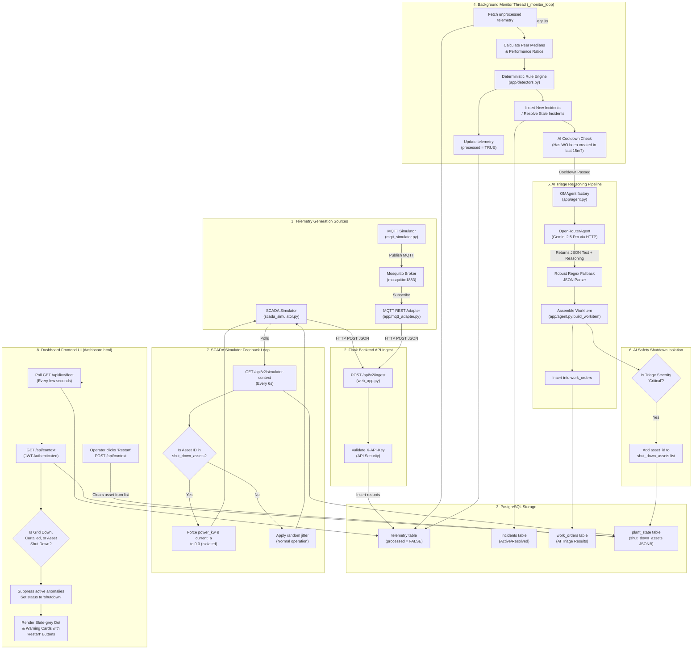

<div align="center">

# ⚡ GridSense

### AI-Powered Context-Aware SCADA Intelligence for Renewable Energy

*Detect the signal. Understand the context. Act on what matters.*

[](https://github.com/venkatanaveen2078909-rgb/gridsense-ai)


<p>
  
  
  
  
  
</p>

[Why GridSense](#-why-gridsense) • [How It Works](#-how-it-works) • [Capabilities](#-key-capabilities) • [System Architecture](#-advanced-architecture) • [Quick Start](#-quick-start) • [Safety & Governance](#-safety--governance)

</div>

---

## 🚨 The Problem

Renewable-energy control rooms don't suffer from a lack of data. They suffer from a lack of **context**. 

A single grid event (e.g., a transmission line trip) cascades into hundreds of downstream alarms across solar inverters, transformers, and meters. This results in **alarm fatigue**, higher **Mean Time to Resolution (MTTR)**, and missed revenue.

```
                    GRID EVENT
                        │
          ┌─────────────┼─────────────┐
          ▼             ▼             ▼
       Inverter       Transformer   Meter
       Alarm × N      Alarm × N     Alarm × N
          │             │             │
          └─────────────┼─────────────┘
                        ▼
                  🔴 ALARM FLOOD
                        │
                        ▼
               Operator investigates
               hundreds of symptoms
```

Traditional SCADA tells operators **what** changed. **GridSense** tells them **why**.

---

## ⚡ Why GridSense?

GridSense is an AI-powered, context-aware SCADA intelligence layer that sits above existing telemetry infrastructure. It blends **deterministic detection**, **contextual reasoning**, and **automated safety isolation** into a single glass panel.

### The Core Design Principle
```
┌─────────────────────┐
│      Telemetry      │
└──────────┬──────────┘
           ▼
┌─────────────────────┐
│  Deterministic RPA  │  ← Fast, cheap, explainable rule engine
│   Rule Detectors    │
└──────────┬──────────┘
           ▼
┌─────────────────────┐
│ Context Correlation │  ← Plant state (Grid Down, Curtailed) + peer behaviour
└──────────┬──────────┘
           ▼
┌─────────────────────┐
│  OpenRouter AI L2   │  ← Google Gemini 2.5 Pro native JSON triage
└──────────┬──────────┘
           ▼
┌─────────────────────┐
│ Auto-Shutdown / WO  │  ← Automated unit isolation & actionable O&M ticket
└──────────┬──────────┘
           ▼
┌─────────────────────┐
│  Operator Override  │  ← Human-in-the-loop manual restart action
└─────────────────────┘
```

---

## ⚙️ Key Capabilities

* **🔍 Real-time Fault Detection:** Scans raw telemetry to identify abnormal equipment behaviour.
* **☀️ Performance Ratio Guardrails:** Separates weather-driven production loss from active mechanical or electrical faults.
* **📊 Peer Benchmarking:** Compares live assets against their immediate neighbors to catch subtle 5–15% underperformance.
* **🧠 Context-Aware Alarm Suppression:** Suppresses cascading alarms on solar arrays during grid-down, curtailed, or plant maintenance states.
* **🤖 AI Triage & Diagnostic Work-Orders:** Creates structured O&M tickets detailing likely causes, probability distributions, estimated revenue loss, and recommended steps.
* **🛡️ Automated Safety Isolation (Shutdown):** Automatically triggers shutdown overrides on assets experiencing critical telemetry threats to prevent physical/thermal damage.
* **👨‍🔧 Operator Restarts:** Keeps humans in the loop with graphical overrides to clear isolation states and resume operations.

---

## 🏗️ Advanced Architecture

The diagram below details the entire data flow: from simulation engines to ingestion pipelines, database schemas, background daemon OMAgents, and UI interaction hooks.



---

## 🚀 Quick Start

### 1. Installation
```bash
# Clone the repository
git clone https://github.com/venkatanaveen2078909-rgb/gridsense-ai.git
cd gridsense-ai

# Initialize virtual environment
python -m venv .venv
# On Windows:
.venv\Scripts\Activate.ps1
# On Linux/macOS:
source .venv/bin/activate

# Install dependencies
pip install -r requirements.txt
```

### 2. Configuration (`.env`)
Create a `.env` file from the provided example:
```bash
cp .env.example .env
```
Configure your credentials:
```env
# Database Configuration (Docker Compose handles default port 5432)
POSTGRES_DB=gridsense_db
POSTGRES_USER=gridsense
POSTGRES_PASSWORD=password123
POSTGRES_HOST=db

# OpenRouter Configuration
OPENROUTER_API_KEY=your-openrouter-api-key
OPENROUTER_MODEL=google/gemini-2.5-pro
```

### 3. Running Locally with Docker Compose
To launch the full suite (PostgreSQL database, Mosquitto MQTT Broker, Flask Web backend, and simulators):
```bash
docker compose up -d
```
Once initialized:
- Access the web dashboard at: **[http://localhost:5000](http://localhost:5000)**
- Default Operator login credentials:
  - **AeroWind Corp:** `admin@aerowind.com` | `password123`
  - **Solaris Energy:** `admin@solaris.com` | `password123`

---

## 🧪 Demo Fault Matrix

| Asset Type | Active Anomaly | AI Triage Outcome | Context Logic | Safety Shutdown Trigger |
| :--- | :--- | :--- | :--- | :--- |
| **Solar Inverter** | Zero Output under high light | High Severity (RemoteReset) | Suppressed if grid goes down | No (Warning banner only) |
| **Solar Inverter** | Internal Overtemperature | Critical Severity (Shutdown) | Monitored individually | **Yes (Forced to 0.0 kW)** |
| **Wind Turbine** | Vibration exceeding threshold | Critical Severity (Shutdown) | High wind limits checked | **Yes (Forced to 0.0 kW)** |
| **Transformer** | Oil Temperature Alarm | Critical Severity (Shutdown) | Load percentage checked | **Yes (Isolated)** |
| **Revenue Meter** | Communication Loss | High Severity (RaiseTicket) | Evaluates adjacent devices | No (Warning banner only) |

---

## 🛡️ Safety & Governance

GridSense separates **Detection** from **Reasoning** and **Execution**:
1. **Deterministic Screening:** Standard rule engines handle the high-volume data stream. AI is only engaged when an active incident is flagged.
2. **Context-Aware Suppression:** Ensures grid disturbances don't flood the operator or AI agents with duplicate incident notifications.
3. **Safety Isolation Override:** Critical physical safety risks are automatically isolated to prevent equipment damage, while retaining **Human-in-the-loop manual override buttons** so technicians can safely override and restart assets.

---

*Powering intelligent operations for the renewable-energy era.*
